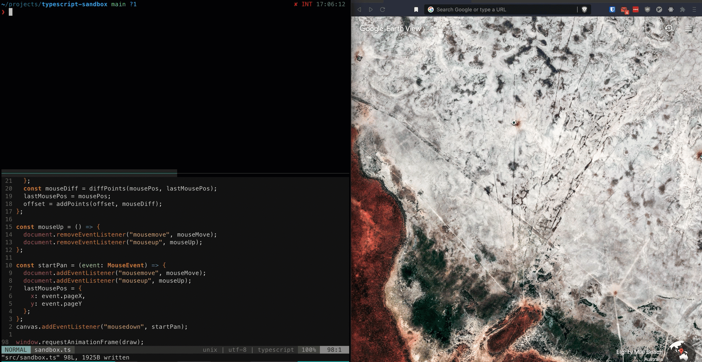

# typescript-sandbox



This is meant to replicate the convenience of the [Vanilla Typescript CodeSandbox](https://codesandbox.io/s/vanilla-typescript-vanilla-ts), but locally.

`npm run start` does the following:
- Recompiles typescript to javascript on save
- Serves an `index.html` that runs the compiled javascript via local webserver with live reloading

There's also a [Docker image](https://hub.docker.com/repository/docker/lrobinovitch/typescript-sandbox/tags?page=1&ordering=last_updated)
if you'd rather not install `node` locally but have docker installed.

```shell
# in this cloned repository
docker-compose run --rm --service-ports sandbox
```

or without `docker-compose`:

```shell
# in this cloned repository
docker run --rm -d -p 8080:8080 -v <absolute-path-to-cloned-repo>/src:/usr/app/src lrobinovitch/typescript-sandbox:latest
```

Then view your `index.html` with live-reloading at [http://127.0.0.1:8080/src/](http://127.0.0.1:8080/src/).
